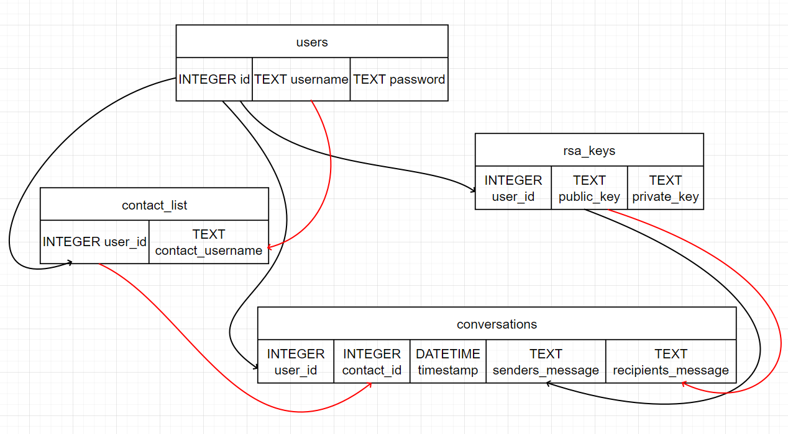

# TNMA031 Lab 4 - Secure web login and RSA communication
## Setup instructions
* Install [Node.js](https://nodejs.org/en), version 18.16+
* Open the project folder in VS Code
* Open terminal in VS Code, make sure you are in the project folder and run:
```PowerShell
node app.js
```
* The server should now be accessible at [http://127.0.0.1:3000/](http://127.0.0.1:3000/)

# Server architecture
The server stores everything using SQLite databases. The architecture between the tables can be seen in the image below. The different colours of the arrows indicates different users. Users create accounts and their username is saved together with their password. The password is hashed and salted using bcrypt. A user can connect to other users via a contact list which connects a user ID with another username. Each user also generates a public and private RSA key which is stored on the server. Ideally, the users would store their private keys on their machine to enable end-to-end encryption, but has not been implemented that way in this project. The public RSA key is used to encrypt messages towards the recipient, who can decrypt it using its private key. 

Since one user can load a conversation between two persons they would have to decrypt the entire conversation. Therefore, two encrypted versions of the messages are stored in the table, one using the current user's public key and one using the recipient's private key. This method allows both users to load the entire conversation when they log in again. 

The conversation also uses a websocket for real time conversation. This would be done on a secure connection if the server is hosted using HTTPS which we did not have a valid certificate for. 
<p align="center">
    
</p>